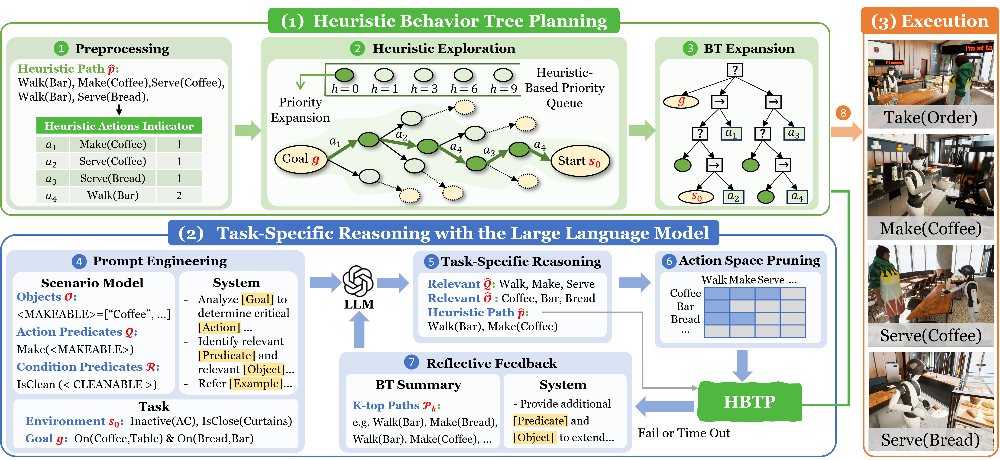

# HBTP: Heuristic Behavior Tree Planning with Large Language Model Reasoning

<div align="center">

[[Website]](https://dids-ei.github.io/Project/HBTP/)


______________________________________________________________________


</div>

## 🌳 Introduction

This repository houses the HBTP package, which integrates large language models, behavior trees, and simulation platforms to foster the development of intelligent agents.

## 📂 Directory Structure

```
LLM-HBTP
└── btgym
    ├── agent                     # Configuration for intelligent agents.
    ├── algos                     # Training and decision-making algorithms.
    │   ├── bt_autogen            # Autonomous behavior tree generation.
    │   │   └── OptimalBTExpansionAlgorithm.py  # Core HOBTEA algorithm implementation.
    │   └── llm_client            # Modules for large language model integration.
    ├── behavior_tree              # Behavior tree engine components.
    ├── envs                       # Scene environments for agent interaction.
    │   ├── base                   # Foundational elements for environments.
    │   ├── gridworld              # Grid-based testing environment.
    │   ├── robowaiter             # Café service robot scenario.
    │   ├── virtualhome            # Household robot scenario.
    │   ├── virtualhomwtest        # Testing environment for household robots.
    │   └── virtualhomwtestsmall    # Smaller version of the household robot testing environment.
    └── utils                      # Supporting functions and utilities.
└── simulators                    # Platforms for realistic training environments.
└── test                          # Testing modules for behavior trees, LLMs, and scene environments.

```

## 🔧 Installation

Create and activate a new Conda environment:

```shell
conda create --name btgym python=3.10
conda activate btgym
```

Install BTGym:

```shell
cd BTGym
pip install -e .
```

### 1. Download the VirtualHome executable for your platform (Only Windows is tested now):

| Operating System | Download Link                                                                      |
|:-----------------|:-----------------------------------------------------------------------------------|
| Linux            | [Download](http://virtual-home.org/release/simulator/v2.0/v2.3.0/linux_exec.zip)   |
| MacOS            | [Download](http://virtual-home.org/release/simulator/v2.0/v2.3.0/macos_exec.zip)   |
| Windows          | [Download](http://virtual-home.org/release/simulator/v2.0/v2.3.0/windows_exec.zip) |

### 2. Download the RoboWaiter executable (Only Windows is tested now):

👉 [Download RoboWaiter](https://drive.google.com/file/d/1ayAQZbPOyQV2W-V_ZdYv6AoqLOg0zvm1/view?usp=sharing)

Download the simulator, unzip it, and run `CafeSimulator.exe` to open the simulator. The simulator will display an empty scene, awaiting the code to generate the scene and complete robot interactions.

## 🚀 Usage

1. Download the simulator.
2. Unzip the downloaded files and move them to `simulators/virtualhome/windows`.
3. Execute `watch_tv.py` to view the simulation:
   ```python
   python test/watch_tv.py
   ```
4. Execute `VHT_main.py` to see the results from the LLM-HOBTEA framework:
   ```python
   python test/VHT_main.py
   ```

These modifications include the addition of relevant icons to each section header for better visual distinction and to match the content topics more closely.


## 🎮 Simulation
The images below illustrate examples from two simulation scenarios, including behavior trees generated by LLM-HOBTEA and their corresponding simulation environments.

### RoboWaiter
The RoboWaiter scenario involves a service robot performing tasks in a café setting. 

**Goal:** `On(Coffee,Table3) & Active(AC)`


### VirtualHome
The VirtualHome scenario simulates a household environment where a robot performs various domestic tasks.

**Goal:** `IsIn(bananas,fridge) & IsClose(fridge)`


## 📜 License

This project is licensed under the MIT License. See the [LICENSE](LICENSE) file for details.


